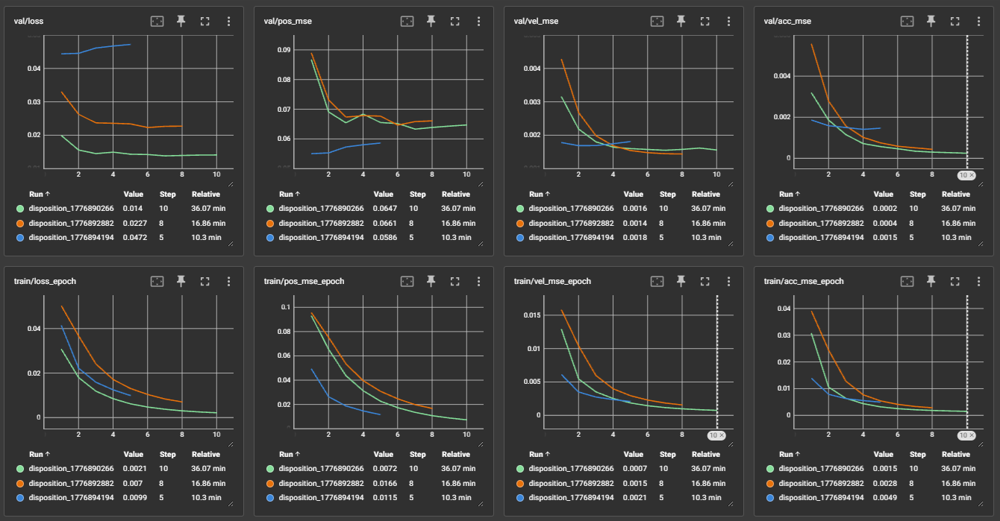
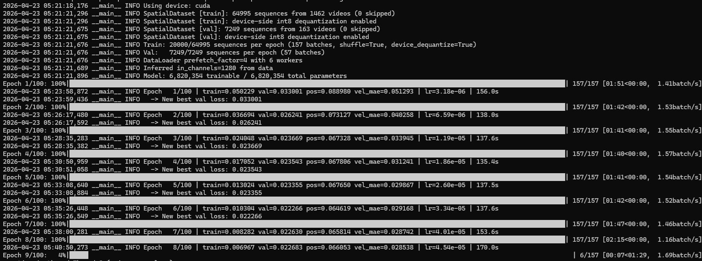

# Motion Help


It makes these. It helps with motion.
There's no clever filtering or peak detection at play here yet.
This one feels like it's got some real potential, and I don't hate the architecture.

Looking at that plot, it might look like noise, but the wiggle at the 23 second mark is spot on.

## Overview

1. You use this to build a dataset from your existing content.
2. And then you use this to train a model on the data.
3. And that helps you build an even bigger dataset.
4. And that lets you train a version that really nails the tempo and magnitude on 95% of sequences, especially on the longer and more tedious scripts which frees you to focus on the bigger questions like, *should I be basing the pos on the hand, or the mouth in this scene?*

---

## Installation

Install [Miniconda](https://docs.conda.io/en/latest/miniconda.html), then:

```bash
git clone https://github.com/herpaderpapotato/motionhelp
cd motionhelp

conda create -p thefullpathtomotionhelp\.conda python=3.13
conda activate thefullpathtomotionhelp\.conda
conda install -c conda-forge "torchcodec=*=*cuda*" "torchvision=*=*cuda*" "torchaudio=*=*cuda*" -y

pip install opencv-python matplotlib tqdm PyYAML pillow scipy psutil polars ipykernel tensorboard requests onnx onnxscript
pip install ultralytics ultralytics-thop --no-deps
```

> **Note:** If you run into issues with missing system libraries, try:
> ```bash
> conda install libglib gdk-pixbuf ffmpeg -c conda-forge --force-reinstall
> ```

---

## Preparation

Preprocessed clips are sourced from your xbvr library. Currently supported source:

- **xbvr on MySQL** ✓
- Target a folder with matching filenames *(not yet)*
- From `main.db` *(not yet)*

Extract clips and labels from your video sources:

```bash
python .\scripts\prepare_videos.py
```

This will extract 5 segments from each of 50 video sources into `.\data\preprocessed` by default. Run with `--help` to see how to change those limits.

While that's running, open a second activated conda environment and start the spatial feature extractor in watch mode:

```bash
python .\scripts\extract_spatial.py --watch
```

You can leave it running or kill it once both scripts complete.

### Curate the dataset

```bash
python .\scripts\visualize_data.py
```

Filter to **Pending**. Press **A** to approve a clip or **D** to reject it.

Review carefully — the interpolation isn't always reliable and there are occasional timing issues with the encoded clips that I haven't fully tracked down yet. Manual review catches a lot of that.

---

## Initial Train

Once you have around **120 approved clips**, build the train/validation split:

```bash
python scripts\build_splits.py
```

Then train:

```bash
python.exe scripts/train_disposition.py
```

> `--batch-size 128` uses around 24 GB of VRAM. The default batch size of 16 uses about 2 GB.

It'll produce something. Not a very good something, but something — and it's enough to start using MSE to guide curation.

Evaluate your approved and pending clips:

```bash
python .\scripts\evaluate_scenes.py
```

Then open the visualizer again:

```bash
python .\scripts\visualize_data.py
```

Sort by **MSE**. Clips with high MSE are where predictions diverge most from labels — review those approved/pending clips and reject the ones that look wrong. Bad clips do sneak through manual review sometimes.

---

## Dataset Expansion and Curation

Pull more samples:

```bash
python .\scripts\prepare_videos.py --max-scenes 2000 --segments-per-video 10
```

While that's running, start these in separate activated conda environments:

```bash
python .\scripts\extract_spatial.py --watch
python .\scripts\evaluate_scenes.py --watch
```

Leave them running or kill them once `prepare_videos.py` finishes.

Then curate again:

```bash
python .\scripts\visualize_data.py
```

Sort by MSE. For low-MSE pending clips you can just hold **A** to approve in bulk. Mid-to-high MSE clips need a closer look before approving.

---

## Train N+1

Once you have around **1100–1200 approved clips**, rebuild the split and retrain:

```bash
python scripts\build_splits.py
python.exe scripts/train_disposition.py
```

To monitor training graphs while it runs, open another activated conda environment and run:

```bash
tensorboard --logdir runs
```

Then open [http://127.0.0.1:6006](http://127.0.0.1:6006) in your browser.

After 5–10 epochs it'll typically hit its best output and start overtraining. The best checkpoint is saved to `data/models/checkpoints_disposition/best_disposition.pt`.

---

## Generation

To generate a funscript prediction for a video:

```bash
python.exe scripts/predict_disposition.py --vr --video benchmark_8k.mp4 --out benchmark_8k.funscript
```

Useful flags:

| Flag | Description |
|---|---|
| `--vr` / `--no-vr` | 180° SBS VR input or standard 2D video |
| `--playback` | Watch the prediction in a GUI as it runs (slower) |
| `--start-time` | Start offset in seconds |
| `--duration` | Duration to process in seconds |

---

## Tune

Once results are okay — and quite often they're quite good — but you want better, refresh your MSE scores:

```bash
python .\scripts\evaluate_scenes.py --overwrite
```

Then review high-MSE approved clips again:

```bash
python .\scripts\visualize_data.py
```

Reject anything that doesn't look right, then go back to [Train N+1](#train-n1) and repeat.

---

## FAQ

**Q1: Why do I have to train my own model — why can't I have yours?**  
A: The scripts I've trained on, I don't have expressed permission to distribute a model trained from. Ethically I'd need that first, which would be a significant undertaking and not really my forte.

**Q2: Conda error, CUDA error, some other error — broken!**  
A: This is a pretty niche thing to be running. The answer is either that you know how to fix your error, or you know how to use AI to help you fix your error. Happy to accept any doc improvements that make sense.

**Q3: Your model is bad and your code is bad.**  
A: Yeah, it's all gone through a lot of changes and iterations. At some point you have to put things out there though. I'm still not 100% sure if I need all 3 spatial features, or if the finetuned YOLO is actually necessary (swapping it would mean regenerating all spatial data), or if the DDL setting is actually better, or if the N-size YOLO models would be better, or a different feature extractor entirely, etc, etc, etc.

**Q4: You're not really doing any augmentation in your training loop.**  
A: Yeah. I'll get to it, but I'm still mulling over Q3 stuff.

**Q5: Wow that's one AI ass README.MD you had AI generated!**  
A: Kinda, check the previous version for the hard to follow notes I had here previously.

**Q6: This whole thing is AI vibe coded slop.**  
A: Some of the newer models have definitely been an accelerator for me in this space, although I'd point to my wall of text posts elsewhere as an evidence that this is notably better than the jank python I normally write.

**Q7: What does training look like?**  
A:  
  


---

## Deeper Technical Notes made by AI

I fixed some of the AI notes here that were wrong. It did alright though.

### Data

Each scene is a short clip (default 20 seconds) extracted from a source video at its native FPS. Alongside the video, the matching funscript is sampled onto the clip's exact output frame timestamps using monotone interpolation. The result is a `labels.npy` array with one float32 value per frame in `[0, 1]`, representing funscript position.

Labels now preserve the full scripted action range and hold the nearest endpoint outside the action span rather than extrapolating past it.

---

### Spatial Features

The core input representation is multi-scale RoI-aligned feature maps extracted from a finetuned YOLO pose model (`vrlens-finetunes-multiclass-v2-yolo26m-pose`). The model is based on the 26m-pose YOLO variant fine-tuned for VR content with 21 keypoints (the standard COCO 17 plus pelvis, umbilicus, and sternums).

During extraction, forward hooks are attached to the neck output at three scales:

| Scale | Stride | Channels | Spatial resolution relative to input |
|---|---|---|---|
| P3 | 8 | 512 | Finest — captures local detail |
| P4 | 16 | 512 | Mid — captures body proportions |
| P5 | 32 | 512 | Coarsest — captures global context |

For each detected person, RoI Align maps each of these three feature maps to a 7×7 grid aligned to the person's bounding box (not really at the moment). The three 7×7 feature crops are concatenated along the channel axis, producing a single `[1536, 7, 7]` tensor per person per frame. This is stored as `[T, N, 1536, 7, 7]`.

The rationale for using all three scales together is that different aspects of motion are encoded at different resolutions. P5 sees the overall body position; P3 sees the finer-grained motion detail. Whether all three are strictly necessary is still an open question — but they're cheap to store and the model decides how to weight them.

#### Storage Format

Spatial features are stored in HDF5 (`data/processed/{scene_id}/spatial/{model_name}.h5`) with:

- **dtype:** int8 per-channel symmetric quantization (or float16 if `--storage-dtype float16`)
- **compression:** LZF
- **quantization:** each of the 1536 channels is independently scaled so its float32 range maps to `[-127, 127]`. The per-channel scale factors are stored alongside the data and applied on load. This trades a small amount of precision for roughly a 4× reduction in storage vs float32.

---

### GPU Decode and Inference Pipeline

The extraction and inference paths are designed to avoid unnecessary CPU round-trips. The pipeline looks like this:

```
Video file
    │
    ▼
torchcodec GPU decode
    → [N, H, W, C] uint8, on CUDA
    │
    ▼
Permute + normalize
    → [N, C, H, W] float32, values in [0, 1]
    │
    ▼
YOLO forward pass (GPU)
    ← Ultralytics accepts CUDA tensors directly
    → Detections + forward hooks capture P3/P4/P5 feature maps on GPU
    │
    ▼
RoI Align (GPU, torchvision)
    → [N_persons, C, 7, 7] float32 per scale
    │
    ▼
Concatenate scales
    → [N, 1, 1536, 7, 7] float16, still on CUDA
    │
    ▼
Copy to CPU / quantize to int8
    → Saved to HDF5
```

The frames never touch the CPU between decode and RoI extraction. YOLO's `predict()` accepts a CUDA tensor directly and the hook-captured feature maps remain on-device throughout. The only CPU transfer is the final copy before HDF5 storage.

During inference (`predict_disposition.py`), the same GPU path is used to extract features on the fly, and those are fed directly into the DispositionTCN without being persisted.

---

### Model Architecture

**DispositionTCN** is a temporal convolutional network that takes the sequence of spatial features and predicts a per-frame position value in `[0, 1]`.

#### SpatialDeltaEncoder

Input: `[B, T, N, 1536, 7, 7]`

Rather than feeding raw features, the encoder computes the frame-to-frame difference and concatenates it with the current frame:

```
[frame_t, frame_t - frame_{t-1}]  →  [B, T, N, 3072, 7, 7]
```

This temporal delta makes motion explicit at the feature level before any temporal modelling. The doubled channels are then reduced by a small 2D CNN:

```
Conv2d(3072 → 256, k=3, s=2) → GroupNorm → GELU
Conv2d(256 → 256, k=3, s=2)  → GroupNorm → GELU
AdaptiveAvgPool2d(1) → Flatten
Linear(256 → encoder_dim)
```

Output: `[B, T, N, encoder_dim]`

#### PersonAttention

With potentially multiple detections per frame, a learned attention mechanism pools across persons. Detection confidence scores are used to bias the attention weights (low-confidence detections are down-weighted):

```
scores = Linear(encoder_dim → 1)
scores += log(conf)            # confidence bias
weights = softmax(scores)
output = sum(weights * features)   →  [B, T, encoder_dim]
```

This one is just hardcoded at the moment so it's not really doing anything :|

#### Dilated TCN

The pooled features are projected to `d_model` and passed through a stack of dilated 1D convolution blocks. With the default configuration (3 blocks, dilations `[1, 2, 4]`, kernel size 3), the effective temporal receptive field is **253 frames** — roughly 4 seconds at 60 FPS. Each block:

```
Conv1d(d_model, d_model, k=3, dilation=d, symmetric padding)
BatchNorm → GELU → Dropout
Conv1d(d_model, d_model, k=3, dilation=d, symmetric padding)
BatchNorm + residual → GELU
```

I've only been using a seq_len of 120, but maybe I'll try 240 later.

#### Output Head

```
Linear(d_model → 64) → GELU → Dropout → Linear(64 → 1) → Sigmoid
```

Output: `[B, T]` in `[0, 1]`, one position value per frame.

---

### Training Loss

The loss combines position, velocity, and acceleration terms so the model is penalised not just for being in the wrong place, but for moving wrong:

$$\mathcal{L} = 0.1 \cdot \text{MSE}(p, \hat{p}) + 0.45 \cdot \text{MSE}(\Delta p, \Delta \hat{p}) + 0.45 \cdot \text{MSE}(\Delta^2 p, \Delta^2 \hat{p})$$

An activity-weighted variant of the position MSE is also computed (frames with more motion get higher weight) and logged for monitoring, though the primary loss above is what drives training.

Training uses AdamW with a OneCycleLR schedule, mixed precision (float16 autocast), and gradient clipping at norm 1.0.

---

### Sliding Window Inference

The model operates on fixed-length sequences (120 frames). For a full video, a sliding window with 50% overlap (stride 60) is used. Overlapping predictions are blended with a Bartlett (triangular) window to avoid hard edges at window boundaries, then normalised by the accumulated weights.