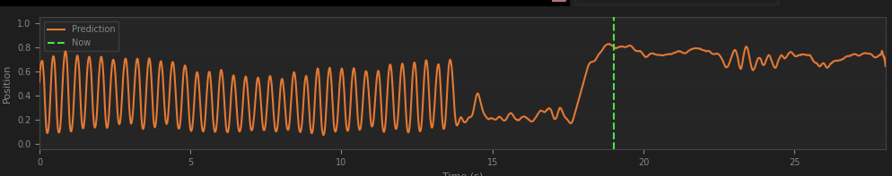

MOTION HELP

It makes these.

INSTALLATION

install miniconda

git clone https://github.com/herpaderpapotato/motionhelp

cd motionhelp

conda create -p thefullpathtomotionhelp\.conda python=3.13
conda activate thefullpathtomotionhelp\.conda
conda install -c conda-forge "torchcodec=*=*cuda*" "torchvision=*=*cuda*" "torchaudio=*=*cuda*" -y

pip install opencv-python matplotlib tqdm PyYAML pillow scipy psutil polars ipykernel tensorboard requests onnx onnxscript
pip install ultralytics ultralytics-thop --no-deps

maybe need to run:
conda install libglib gdk-pixbuf ffmpeg -c conda-forge --force-reinstall

PREPARATION

Create preprocessed clips from your xbvr library
Use xbvr on mysql
or target a folder with matching filenames (not yet)
or from main.db (not yet)

run
python .\scripts\prepare_videos.py

It'll extract 5 scenes and labels each from 50 of your video sources into .\data\preprocessed. You can generate less by changing parameters. See the --help argument.y

While that's running, in another activated conda run 
python .\scripts\extract_spatial.py --watch

Again, can leave that running or kill it once it and prepare_videos.py completes.

Next, curate the set with:
python .\scripts\visualize_data.py

Filter to just pending. Press A to approve a Scene or D to reject a scene.
Partly the interpolation is having a bad result, partly theres something happening with timings when encoding them, I haven't run the issue down yet, but reviewing clips for accuracy is important.

INITIAL TRAIN

Once you have about 120 videos approved, then run.

python scripts\build_splits.py

That'll create a train/validation split. To train, run:

python.exe scripts/train_disposition.py

--batch-size 128 uses about 24gb of VRAM. The default is 16 which will use ~2gb of VRAM.

It'll train something. Not a very good something, but something.

Next run
python .\scripts\evaluate_scenes.py

It'll calculate the mean score for each clip in the approved an pending dataset and create a prediction. Use

python .\scripts\visualize_data.py

To sort by MSE. Review approved/pending ones with high MSE and determine if they're good or bad. Sometimes bad ones sneak through the manual review.

DATASET EXPANSION / CURATION

Get more video samples, run
python .\scripts\prepare_videos.py --max-scenes 2000 --segments-per-video 10

While that's running, in another activated conda run 
python .\scripts\extract_spatial.py --watch

Also run
python .\scripts\evaluate_scenes.py --watch

Again, leave them both running or kill once they and prepare_videos.py completes.

Again run
python .\scripts\visualize_data.py

Sort by MSE. Review pending and you can just hold A to approve the ones with low MSE. In the mid to high MSE you need to review before approval.

TRAIN N+1

Once you have about 1100 to 1200 approved run
python scripts\build_splits.py
and then
python.exe scripts/train_disposition.py

To see training graphs on http://127.0.0.1:6006 while it runs you can open another activated miniconda and run
tensorboard --logdir runs

After 5 to 10 epochs it will likely reach it's best output and then start to overtrain. Te best epoch will be saved as data/models/checkpoints_disposition/best_disposition.pt

GENERATION

To generate a prediction, run
python.exe scripts/predict_disposition.py --vr --video benchmark_8k.mp4 --out benchmark_8k.funscript 

Use:
--playback to watch in a gui while it runs (slower)
--start-time and --duration to set those in seconds for a partial generation
--vr for a 180 SBS VR video or --no-vr for a normal 2d video 

TUNE

Realize that it's okay, and quite often good, but needs to be better and then go back and update the mse of your dataset with
python .\scripts\evaluate_scenes.py --overwrite

and then review all the approved scenes with high mse in visualize again with
python .\scripts\visualize_data.py

and then goto TRAIN N+1 for another go around!

Q. Why do I have to train my own model, why can't I have yours?
A. The scripts I have trained on, I do not have expressed permission to distribute a model trained on them. Ethically I would need that first, which would be a significant undertaking that is not my forte.

Q. Conda error, CUDA error, other error? Broken!
A. I feel like this is a pretty niche thing to running, and the answers will either be that you know how to fix your error, or you know how to use ai to help you fix your error. I'll accept any changes to the doco proposed that make sense.

Q. Your model is bad and your code is bad
A. Yeah, it's all undergone a lot of changes and iterations. At some point you have to put things out there though. I'm still not 100% sure if I need all 3 of the spatial data but I'm working on it. I'm not sure if I actually need the finetuned yolo, but it'd require regenerating spatial data for a different one. I'm not sure if the ddl setting is really better than not. Maybe I should use the n size yolo models, or a different feature extractor etc, etc, etc.
